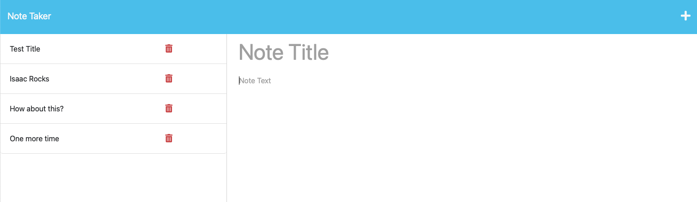

# Note-Taker

## Description

The Note Taker App is a web application that enables users to write, save, and organize their notes. It provides a user-friendly interface for creating new notes, viewing existing ones, and deleting notes when they're no longer needed. The app is built using Node.js and Express, with a JSON file serving as the backend database.

## Features

- Create new notes with titles and content.
- Save and manage notes using a JSON backend.
- View a list of existing notes and select them for editing.
- Delete unwanted notes from the list.

## Installation

To use the Note Taker App, follow these steps:

1. Clone this repository to your local machine.
2. Navigate to the project directory using the terminal.
3. Install the required dependencies by running the command: `npm install`

## Dependencies

The following npm packages are used to build this project:

- [express](https://www.npmjs.com/package/express): For building the web application.
- [uuid](https://www.npmjs.com/package/uuid): For generating unique IDs.
- [util](https://www.npmjs.com/package/util): For utility functions.

You can install them using the command: `npm install express uuid util`

## Usage

1. Open your terminal.
2. Navigate to the project directory.
3. Run the application using the command: `npm start`
4. Open your web browser and go to `http://localhost:3001` to access the app.
5. Create new notes, view existing ones, and delete notes as needed.

### Preview

[Link to Heroku Build](https://dashboard.heroku.com/apps/stark-tor-39568)

## License

This project is licensed under the terms of the [MIT License](https://opensource.org/licenses/MIT).

## Contributions

Contributions are welcome! If you encounter any issues or have suggestions for improvements, please open an issue or submit a pull request.

## Questions

If you have questions or need further assistance, feel free to reach out:
- GitHub: [IsaacOnGH](https://github.com/IsaacOnGH)
- Email: isaac.melanson@yahoo.com